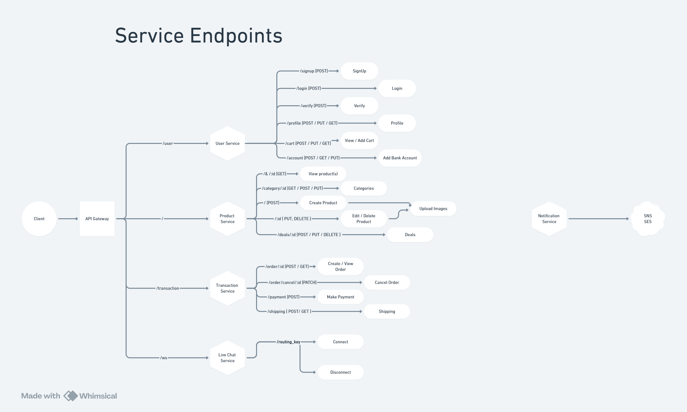
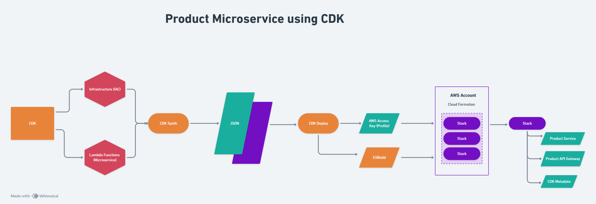
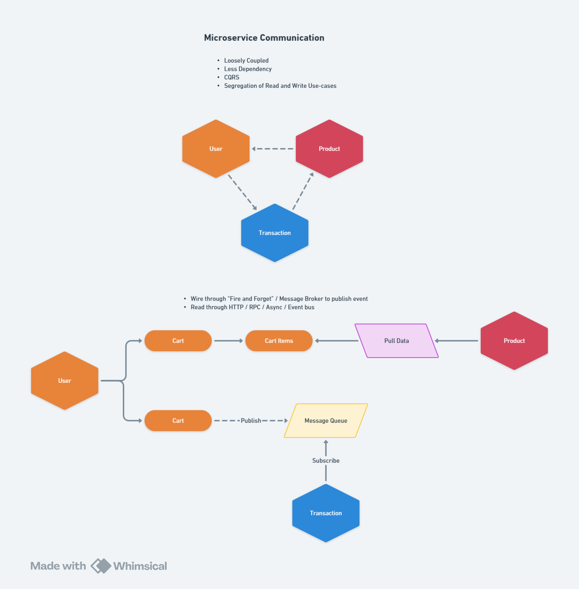
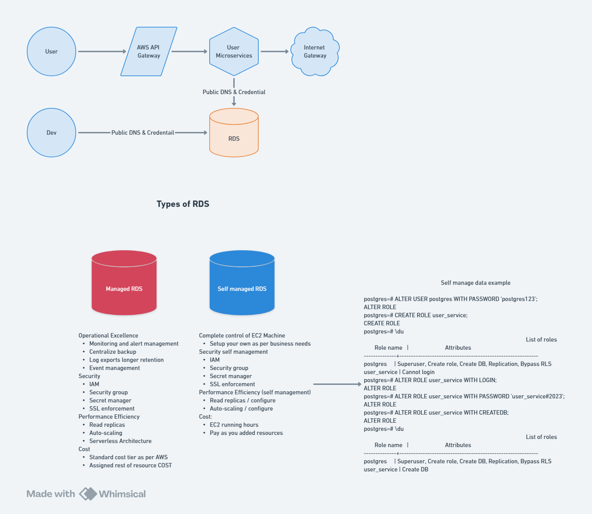
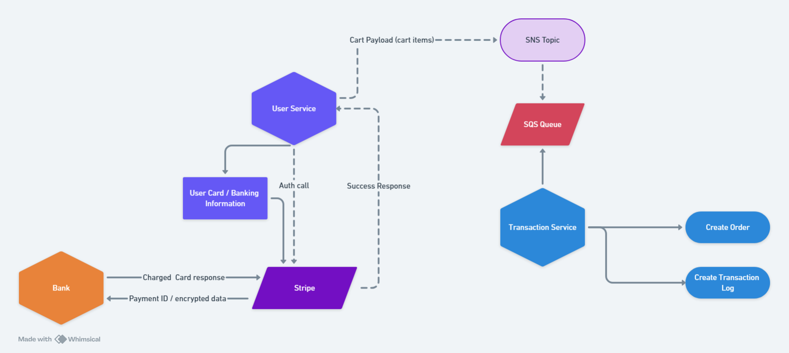
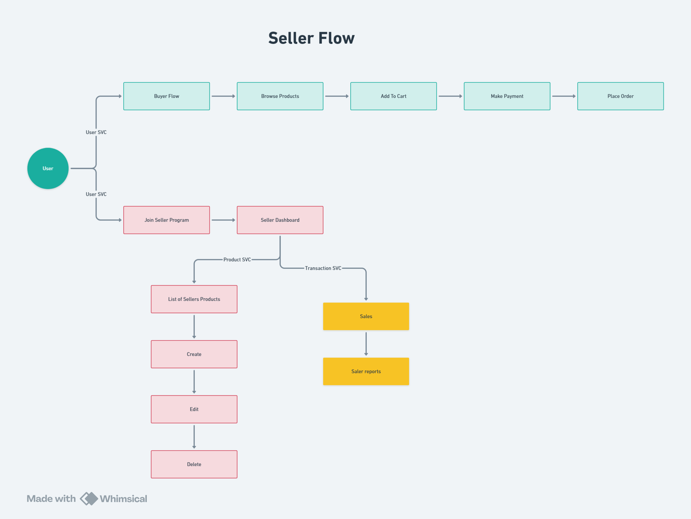

# Resale-nodejs-serverless

Mimic ebay like backend behaviour.

Techstack:

- nodejs
- Typescript
- serverless
- AWS CDK/SDK
- AWS SNS/SQS
- AWS EC2 (self managed postgres on ubuntu machine)
- PostgreSQL
- MongoDb
- Amazon S3
- Stripe integration
- Twilio
- Sendgrid
- AWS SES

### TLDR
Each service has its package.json file which has command to run for dev, remember to set data for postgres and mongodb properly. Also set env variables, some are inside code as a dev playground, some services have .env

### NOTES
- Remember to add .env file (was not available in previously) and fill it with proper data

## Project Design

1. Product requirements
2. System Design
3. Technology & Infrastructure
4. CICD

### 1. Product requirements

Build a web application to manage buy/sale of new and used/old products in certain price range.
Client in position of buyer should be able to search/view products of choice and buy it online.
As for a client being the seller he should be able to post products with description,
advertise them and manage their prace/existance.

App should provide way of communication between seller and buyer, the communication should be fully direct
without need of a 3rd party "person" all should be allowed through app. Also possibility to buy products with given price
Payments system should collect the money for the product and a fee of some % of the final product price. Mentioned % will be
passed to app owner and rest will transferred to the seller.

Buyer can rate purchase experience, seller and delivery. Manage communication of the process
through sms or/and email.

#### Use cases
* Seller can sale products online
* Buyer can purchase products online
* Transaction will take place between C2C (Client To Client)
* A fee of % will be charged per final transaction
* Notification/communication channel needed to colaborate between seller and buyer

### 2. System design

1. Functional requirements - define what a product must do and what its features and functions are.
2. Non functional requirements - describe the general properties of a system. They are also known as quality attributes.
3. Data storage requirements

Functional vs Non functional requirements
|                              |                Functional requirements                     |                       Non functional requirements                      |
| :--------------------------: | :--------------------------------------------------------: | :--------------------------------------------------------------------: |
|           Objective          |     Describes what product does                            |                       Describes how product works                      |
|           End result         |     Define product features                                |                       Define product properties                        |
|           Focus              |     Focus on user requirements                             |                       Focus on user expectations                       |
|           Essentials         |     They are mandatory                                     |                       They are not mandatory but desireable            |
|           Origin type        |     Usually defined by the user                            |               Usually defined by developers or other tech experts      |
|           Testing            | Component, API, UI, testing, tested before non functional  | Performance, usability, security, etc. Tested after functional testing |
|           Types              | Authentication, authorization levels, data processing, reporting etc. |    Usability, reliability, scalability, performance etc.    |

#### 1. Functional requirements
1. User Can Sign-up / Login
2. User verification
3. User can become seller / buyer
4. Seller can Create / Update / Delete Products
5. Seller can advertise products
6. Buyer can purchase product/s using online payment (Cart / Online Banking etc.)
7. Seller can receive payout
8. Email / message notifications
9. Online chat with seller and buyer

#### 2. Non functional requirements
1. System should be highly available in cloud with multiple regions because this is C2C portal
2. System should maintain best practices to be able to scale horizontally (Adding more instances) at any level
3. System should design should leverage microservices pattern
4. Loosely coupled services and communication
5. It should have mechanism for logging and monitoring to inspect services health and availability
6. System should be designed with documentation for better scope of usability
7. Should follow CQRS (separates the data mutation, or the command part of a system, from the query part)

#### 3. Data storage requirements
1. Should be consistent or eventually consistent (manage data when between save and read can be delay time)
2. Should follow CAP theorem (Consistency, Availability, Partition tolerance)
3. Distributed database system and high availability
4. High availability of object storage for multiple regions

#### Basic Architecture

### 3. Technology & Infrastructure
#### Application Structure

#### Possible Techstack

From Possible techstacks Serverless + AWS CDK has been picked.
It will allow seamless deployment and instant scaling when needed. Also it can very easly switch between languages when used only support in AWS is required. We can focus purely on application logic mostly and some basic configuration.

#### Database expectations
##### User
* Create Account (Buyer / Seller)
* Contact Details
* Address
* Payment Methods
* Shopping Cart
* Cart Items

##### Transaction
* Order
* Transactions
* Shipping

##### Products & Deals
* Order
* Transactions
* Shipping

##### Chat
* Live Chat
* Participants

#### Db entities

#### Service endpoints

#### CDK overview
How AWS-CDK architecture look like in contrary to serverless library itself aws-cdk allows more insights into
how to create whole infrastructure with a code and lambdas, we have to take care of building blocks ourself.

#### Microservice communication
To follow microservice architecture, we have to separate data and resposibilities between services, yet to have fully functioning app we require a communication between those services. To achieve that we can leverage multiple patterns. For this project we will use only part of available solutions

#### RDS Management
To use databases in production we need them in the cloud not just locally from docker,
to achieve that we can leverage AWS RDS which comes in two possible configuration (main focus is on self managed). Different types of settings provides different pros and cons, the more AWS manages it for You the more You pay.

#### SNS & SQS flow
SNS stands for Simple Notification Service and SQS stands for Simple Queue Service, both are often used to serve as event driven architecture mechanism. Ofet used in stead of Kafka or RabitMQ (or working together with them depending on the need).

Example flow:
1. After cart creation we have all "items" ready
2. User tries to place the order (Frontend -> Backend call)
3. Backed user service will call "Stripe" which will take care of encrypting and passing payment data to proper bank account
4. Bank will validate data provided by the Stripe and then if successfull, charge the card/account
5. Return response to "Stripe"
6. Stripe with webhook will provide response to user service
7. User service creates SNS message which will be moved to SQS Queue
8. From SQS Queue transaction service will extract messages

To leverage mentioned flow Publish & Subscribe pattern is used also (someone/something publish message someone/something listens and extract the message)

Also pulling from queue (for SQS) will be used, both of those services and techniques will provide good throughput and efficiency

#### Seller flow
In contrary to being able to buy products, You can be a seller and do CRUD operations for products, here is a flow of operations for seller and buyer

### Possible improvements
* introduce .env in each service
* add sending email through notification service after placing order etc.
* code cleanup
* introduce proper loger
* add transactions/products monitoring

@ Code/Design based on internet tutorial used as a reference for training purpose! https://github.com/codergogoi/nodejs-sls-master-class.io